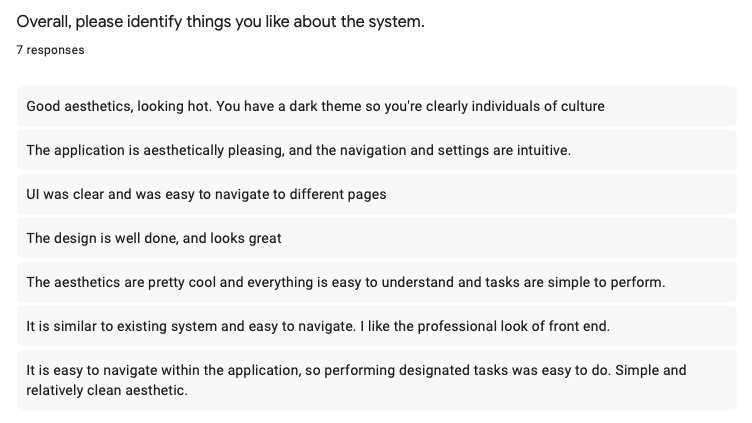
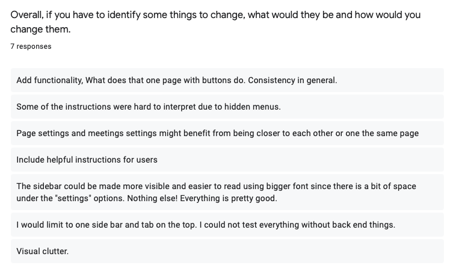
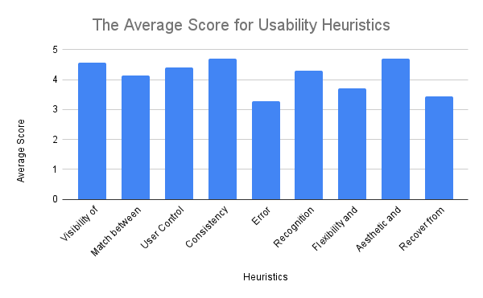

# Heuristics Graph

### Heuristic Evaluation Comments

The following images include the comments that were received from our participants following each peer testing section.

### Heuristics Evaluation Plot

The above figure is the graph of the quantitative scores received from the surveys completed after our peer testing
sessions. We had seven participants instead of eight as we had one participant that did not show for their session. The
heuristics are represented based on the ordering of this
article [Nielsen's 10 Usability Heuristics](https://www.heurio.co/nielsens-10-usability-heuristics), the last bar,
represent the combination of the final two heuristics due to their similarity.

Based on the results we received from our survey the usability heuristics for our application are in a very good spot.
There are three main heuristics we should work on improving: error prevention, flexibility and efficiency of use, and
helping users recover from errors/help and documentation.

Based on the comments from the Heuristic Evaluations Improvements figure, it is clear that these comments match with the
quantitative data received from the surveys. Specifically, the comments related to providing better instructions and
help to users, are an indication of the error prevention heuristic, and the helping users recover from errors/help and
documentation heuristic. These are key areas we need to focus on improving. Secondly, the comments related to visibility
and reformatting of menu locations to make a user’s usage of the software easier, are related to the heuristic: the
flexibility and efficiency of use, which we will be looking to improve in the next milestone.

As seen from both the comments and quantitative data, we have a clear understanding of where we should focus our
improvements in our UI.

